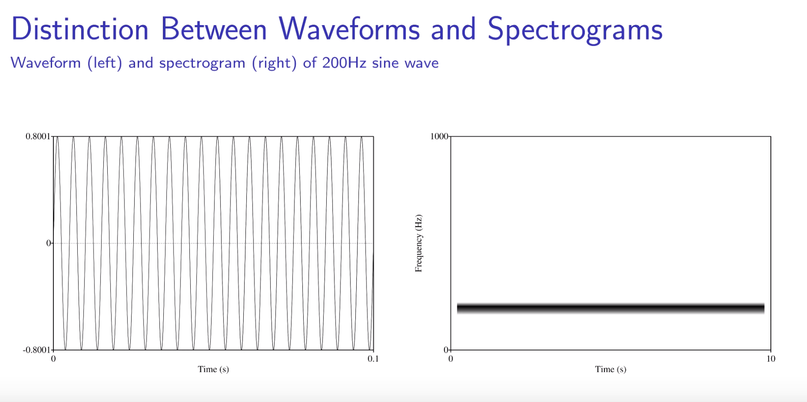
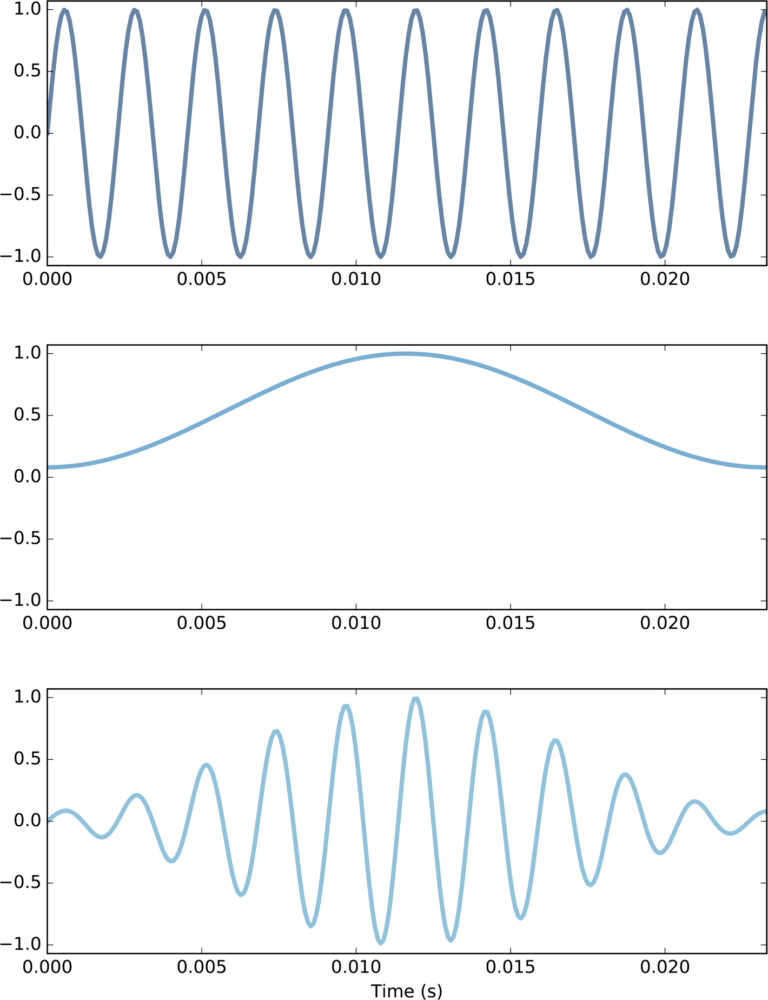
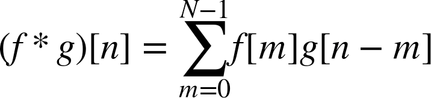
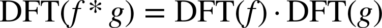
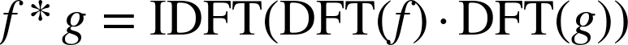

# "Think DSP": Notes

#### Appendix: Wikipedia Notes on Signals and FFT
[Wikipedia article](https://en.wikipedia.org/wiki/Time%E2%80%93frequency_representation) and [this one](https://en.wikipedia.org/wiki/Time%E2%80%93frequency_analysis) for intuition about the meanings of Signal, Frequency, FFT, Spectrum
* Signal is a function of time, with perfect time resolution
  * x-axis time, y-axis amplitude
* Fourier transform decomposes compound signal into component frequencies and relative amplitudes, but has __no__ time information. It's like a bar graph where x-axis is frequency and y-axis is amplitude.
* Another way to say this about FT is that it assumes a signal of infinite duration (and no envelope)
* But note that time-aware analysis can discover the period in the signal and reduce its representation in terms of data and mathematically -- canonical example is that `sin` is four 90-degree rotations of a quarter-rotation of a circle
* To handle signals that change over time often we break up the signal into temporal regions and apply FT to each region. FT requires a slowly-changing signal and that it is integrable.

#### Signals
* `Periodic Signals`
  * Signals that repeat over some period
  * A period is also called a cycle
  * Frequency - inverse of the period
    * Measured in cycles / sec or Hz
    
* Signals can vary in any dimension, not just time
  * e.g. - elevation along a hiking trail
  * e.g. - a picture varying in pixel color along two axes
  Signals can vary in multiple dimensions
  * e.g. - a movie varying in color along two axes and over time
  
#### Signals and Waves
* `Signal` - a quantity that varies over time
* A mathematical function defined for all values of time
* Evaluated periodically, or sampled at the sampling rate, results in a `wave`
* __Signals are continuous, Waves are discrete__
* "A wave is a signal evaluated at a sequence of points in time"
* Each point in time is a `sample` or `frame`
* `sample rate` or `frame rate` is the period of the time interval between each sample in the wave, or also the frequency of samples over the continuous signal
* `timestep` is the time between frames, i.e. the portion of the signal __not__ being sampled between each sample

#### Sound as a Signal
* Sound signal - variations in air pressure over time
* Shape of a waveform creates its timbre
* `Interval` - perceived pitch difference between two sounds by human hearing
  * Depends on the ratio of the two pitches, not the difference
    * e.g. - one octave higher is 2 * freq
    * Perceived doubling is exponential not linear
  * This means that linear difference in frequency between pitches over time will "front load" the perceived ramp up, it will be logarithmic in shape and perceived pitch, or, put another way, the ramp up will sound like it is slowing down over time because linear falls further and further away from doubling in the same duration for each octave away from the starting frequency. Linear vs. exponential.

#### Transducers
* `Microphone` - converts variations in air pressure to an electrical signal
* `Speaker` - converts an electrical signal to variations in air pressure
  * Both are `transducers`

#### Spectral Decomposition
* Any signal can be expressed a sum of sinusoids
* NOTE: This decomposition transforms the Signal from its original domain, for example time *into* the `frequency domain`. This is fundamentally what FT does. See [here](https://en.wikipedia.org/wiki/Fast_Fourier_transform).
* `Discrete Fourier Transform (DFT)`: `f(signal) -> set of sinusoids`
  * Takes a signal and returns the set of sinusoids that compose it
* `Fast Fourier Transform (FFT)` - fast way to compute DFT
* Result is a set of (frequency, amplitude) tuples
* Fundamental frequency - lowest in set
* Dominant frequency - highest amplitude in set
* In waveforms generated by Wester musical instruments, there tend to be higher amplitudes at harmonic intervals, frequencies harmonically related to and consonant with the fundamental, e.g. octaves, fifths, sevenths

##### Spectrum
* The `Spectrum` of a `wave` is the plot of its spectral decomposition
* Spectrum in the ThinkDSP code is also used to filter a wave, providing high-pass, low-pass and band-pass methods
* Each sample in a spectrum is an imaginary number, a tuple of a real and imaginary number, in this case floats
  * The imaginary part of an imaginary number can be expressed as an angle in radians, so this representation is useful for samples because the "angle" is equivalent to the phase offset along the periodic curve of a periodic function. i.e. divide a full period into 360 parts and express where in the period we are (the offset) in radians.
  * Can also just think of this as a tuple `(amp, offset)`
* Note that each spectrum element can be described by three values:
  * amplitude - the magnitude of this periodic signal, for audio signals this is the volume 
  * frequency - the period of this periodic signal
  * offset - the offset of this periodic signal relative to the start of the compound signal and this periodic signal function
    * e.g. `cosine` could be expressed as `sine` with an offset of 90:w

##### Integrated Spectrum
* Similar to Spectrum but instead of amplitude entries there are power entries, which is amplitude squared
* The power entries are stored as cumulative sum, normalized over the last entry, not the raw data
* The result shows the rate of increase of power over time
* Plotting this, for example, for white noise, shows a straight 45 degree line, because all frequencies are present equally, that is there is no acceleration or deceleration anywhere in the curve

#### Harmonics / Harmonic Structure
* `Harmonic Structure` - the set of sinusuoids making up a waveform, synonym for `spectrum`
* Sinusoid has only one frequency component, so it's decomposition has only one peak. More complex waveforms have DFT's with multiple sinusoids and therefore multiple peaks.
* `harmonic structure` is defined mathematically as the relationship between amplitude and the difference between a harmonic and the previous harmonic.

##### Triangle Wave
* Signal moves diagonally over period from -amp to +amp and back - one up/down is a period
* Harmonics at odd multiples of the fundamental, with decay in amplitude
  * Harmonic structure: amplitude drops in proportion to square of the difference in frequency between current and previous harmonic, (n1 - n0)^2, ~2.9

##### Square Wave
* Signal alternates between -amp and +amp with no values in between
* Contains only odd harmonics like Triangle
* Harmonic structure: amp drops in proportion to delta in frequency of current and previous harmonics, but drops linearly, i.e. more slowly

#### Aliasing
* Sompling rate of wave is too low relative to the signal frequency, meaning samples create a distorted version of underlying signal
* Aliasing occurs when more then on signal frequency map to an identical wave at a given sampling rate
  * e.g. - cosine at 4500 and 5500 Hz
* `Nyquist frequency` or `folding frequency` - The maximum signal frequency that can be represented in a wave at a given sampling rate without aliasing occuring
* Nyquist frequency = Sampling Rate / 2

#### Non-Periodic Signals
* Change frequency components over time
* Linear Chirp
  * Takes start and end frequency and linearly changes frequency over time
  * Implementation does `np.linspace(start_freq, end_freq)` which linearly interpolates
  * Full algorithm:
    * `freqs = np.linspace from start to end freq`
    * `times` = array of times from start time to end time
    * `diffs` = array of diffs between each time, constant value array if the time interval is constant
    * take the `cumulative sum of 2PI * freqs * diffs`, which is an array of the total phase change at each step, since each step is an incremental additional change
      * NOTE: The actual formula is `Delta_Phi = 2PI * f(t) * Delta_t`
        * Here `f(t)` is `freqs`, the frequency samples, so cumulative sum is the same as integrating the frequency curve over each step from start to t at each t
* Frequency is the derivative of phase. Phase is the integral of frequency.
* Exponential Chirp
  * An interval function that wants the interval to be perceived as linear needs to increase exponentially not linearly, per above discussion in "Sound as a Signal" about `interval`
  * Project start and end frequencies in log space instead of linear space
    * take log of start and log of end
    * `freqs` is `logspace` from `log(start)` to `log(end)`

#### Spectrogram
* A series of FFTs over short intervals, in time over a wave
* Each `Short-Time FFT (STFT)` is plotted with time on x-axis and frequency on y-axis. This amounts to a series of small plots lined up in time.
* The waveform plot is a visualization of air pressure over time, or you could think of it as a plot of a periodic the signal function. But the spectrogram is one level higher as an abstraction, showing a plot of the *frequency* of the periodic function over time. And because it's one level up, plotting the value of another function over time, it is a windowing function (where windowing here means bucketing values in time windows, the time series meaning of windwowing. Signal processing also has a different meaning, see below section "Windowing").  
* Each plot represents the entire frequency range found from (min, max) in the entire sample, dividing the range into ranges and representing the amplitude at a given frequency window by color or density. Time is plotted on the x-axis and this too is windowed. So you can think of the plot as a grid of cells. The height of each cell is a range of frequencies, and the width of each cell is a duration of time. Frequency samples are windowed both by time and frequency bucket in the chart.
  * `frequency resolution` - frequency range between elements in the spectrogram spectrum
  
Example:


##### Gabor Limit
  * The maximum resolution vertically, the resolution of number of frequencies is length of the segment / 2. e.g. if we choose 512 frames per segment we can represent 256 frequencies. `TODO:` Why?
  * Maximum time resolution r is `framerate / 2`, because of Nyquist
  * So time resolution, frequencies `n` per unit time is `n / r`; and frequency resolution, time frames per frequency, is `r / n`
    * Small time resolution means we can see more rapid changes in frequency, more resolution over change in frequency over time
    * Small frequency resolution means we can see smaller changes in frequency per unit time
    * But because each resolution is the inverse of the other you can't have both: detecting changes over shorter periods of time means seeing only broader changes in frequency, and detecting changes over more granular ranges of frequency means detecting them over broader periods of time.
    * This is the `Gabor Limit`

##### Leakage
* DFT assumes input is a finite segment of a complete period of an infinite recurring periodic signal
* This causes problems:
  * Discontinuity - if the sample is not a perfect complete period the DFT creates artifacts which aren't part of the signal because it always connects the beginning and the end
 
##### Windowing
* Spectrogram windowing tries to reduce frequency leakage described in "Leakage" section
* This simply multiplies a wave by a function that smooths out discontinuity. e.g. Hamming window is an inverse bowl shape that tapers beginning and end to zero and rises in the middle.


#### Noise
* Sound in which frequency distribution has a random element
* Spectrum, plot amplitude, will look like random jaggedness
* `Power` is the square of amplitude, more typical to plot spectrum of power for noise
* Power has an inverse exponential relationship to frequency, about `1.8 / f^2` for Brownian noise
  * That is `P = K / f^2` where K is a constant, P is power and f is frequency
  * So, also `Amplitude^2 = K / f^2`
    * As frequency gets higher, amplitude gets lower, and vice versa
  * Plotting the loglog of power over time shows this curve
* So noise is characterized by distribution, correlation and relationship of power to frequency

##### Uncorrelated Uniform Noise (UU)
  * Uniform distribution of amplitude from -A to A
  * Each value is independent
  * Notice - there is still signal frequency even though there is no periodic function defined by the amplitudes
    * The intuition is that this is the "motion" of amplitude from one sample to the next
    * For example, in uniform white noise the frequency distribution is even over all frequencies

##### Uncorrelated Gaussian Noise (UG)
  * Gaussian distribution of amplitude from -A to A
  * Power is proportional to `1/f^2`
  * White noise, but random values are from a very constrained distribution

##### Brownian Noise
* `Brownian` noise, current amp is previous amp +- random value, so this is correlated
  * Can be thought of as a random walk, a series of steps, each step random and uncorrelated
  * Notice that this means the final position is the sum of all steps, so can implement this as a cumulative sum of random steps
  * Power is proportional to `1/f^2`
  * Also called `red noise`
  
##### Pink Noise
* `Pink` noise - amp is `1/f^b`, so lower sounds are louder
  * White noise has power proportional to `1/f`, red noise is proportional to `1/f^2`
  * Pink noise has power proportional to `1/f^b` where `1 <= b <= 2`
  * Can be generated by starting with white noise and applying a low-pass filter. A low-pass filter means raising the frequencies to a power of b/2, i.e. dividing through by a power between 1 and 2. This lowers the frequency values, which audibly is a lower-pitched sound

#### Correlation
* Pearson's Correlation Coefficient: `Sum_i [(x_i - mean_x) * (y_i - mean_y) / N * std_dev_x * std_dev_y]`
  * In signal processing, often the mean are 0, meaning the signal is `unbiased`, and the standard deviation is 1. So this simplifies to `1/N * Sum_i [x_i * y_i]`
  * Simplify further by dropping the `1/N` term and you have `Sum_i [x_i * y_i]`, which is the `dot product` of x and y
  * Dot product of two normalized signals is `cos Theta` where Theta is the angle between the vectors
* `Correlation` of two varilabes measures how much one predicts the other. 1.0 means if A is high then B is high. -1.0 means if A is high B is low. 0.0 means no correlation
* Only measures linear correlation. There can be non-linear correlation that is not captured.
* `Serial Correlation` measures the correlation of a signal changing in time at one point in time to another point in time
  * Audio signals typically have high serial correlation
  * Measure by taking segment, shifting, taking second segment, measuring correlation
  * Brownian Noise has very high serial correlation
  * Uncorrelated Uniform Noise has very low
* `Autocorrelation` - function mapping every periodic lag in range of the duration of the wave to the correlation at that lag:
```python
def autocorr(wave):
    lags = range(len(wave.ys)//2)
    corrs = [serial_corr(wave, lag) for lag in lags]
    return lags, corrs
```
* `Long-range Dependence` - strong correlation even for long lags

#### Discrete Cosine Transform

##### Synthesis of Wave From Times and Frequencies
* Given frequency components and amplitudes, how can we construct a wave?
  * Naive implementation
    * For array of array of frequencies and array of array of amplitudes, make a `CosSignal` for each paired frequency and amplitude array then sum them
    * Make a wave by sampling the summed signal at times in array `ts`
  * Linear algebra implementation - faster
    * Take the `outer product` (which is the cross product) of times and frequencies. This gives you a 2D matrix where rows are times and columns are frequencies.
    * Multiply this by `2PI` and then take the `cos` of it, which projects the rows of frequency samples by time as offsets in radians into periodic radius of circle function -- THIS IS LIKE MODDING !!
    * Now dot product each row by the amplitude matrix -- number of columns (frequencies) must match number of amplitude dimensions. Dot product multiplies the amplitude vector by each row and sums the row. The result is a vector. NOTE: This is the same sequence of operations as the first implementation.
    * For example: If there are three frequencies and the amps are 0.1, 0.2 and 0.3, then each result is the sum of the weighted frequencies at each time t1, t2, t3, `0.1 * f_1(t_1) + 0.2 * f_2(t_2) + 0.3 * f_3(t_3)`
* Expressed in linear algebra:
  * `M = cos(2PItOf), where O is outer product`
  * `y = Ma`
  
##### DCT - Analysis of Signal to Get Amplitudes for Frequencies
* `DCT` is similar to `(F)FT` -- opposite problem, given a signal and a set of frequencies, how can we find the amplitude of each frequency?
    * We need to solve the system of two linear equations given above. The inputs are `f` and `t` the frequencies at time intervals, i.e. we have the component Signals. The output we are solving for is the amplitude of each `f`, i.e. `a` in the above equation. `M` is a function of `f` and `t`
    * Naive implementation, just use `numpy.linalg.solve(M, ys)`, which is `O(N^3)`. "Solving a linear system of equations takes time proportional to n3, where n is the number of columns in M"
    * Another approach is to use the inverse matrix of `M`, `M^-1`, because `M dot M^-1` gives identity matrix `I` and `I` * any vector is just the vector. So
      * `M^-1 dot y = I dot a = a`
    * Left side of this is dot product, which is `O(N^2)
    * But inverting a matrix is slow unless the matrix is `orthogonal`, meaning where `M^T` is the `transpose` of `M` that `M^T dot M` == `inverse` `M^-1`
      * `Transpose` is the pivot of the matrix, i.e. columns become rows
      * example:
```python
>>> x
array([[1, 2],
       [3, 4]])
>>> x.transpose()
array([[1, 3],
       [2, 4]])
```
  * Computing transpose is constant time operation, so if transpose equals inverse we can compute proportional to dot product `O(N^2)`
  * Often we can achieve this with small, reversible manipulations of `M`, e.g. adding or multiplying by constants. There are mutliple versions of DCT that accommodate multiple different transformations.

Example of building inputs without creating orthogonal M

```python
def test1():
    amps = np.array([0.6, 0.25, 0.1, 0.05])
    # Number of samples
    N = 4.0
    time_unit = 0.001
    # Sample times
    ts = np.arange(N) / N * time_unit
    # max_freq, divide by 2 because of Nyquist
    max_freq = N / time_unit / 2
    # frequencies at sample times
    fs = np.arange(N) / N * max_freq
    # Now pass these args to O(N^3) linear algebra solver to get amps
    ys = synthesize2(amps, fs, ts)
```

Example creating orthogonal matrix M:
 ```python
def test2():
    amps = np.array([0.6, 0.25, 0.1, 0.05])
    N = 4.0
    # Add 0.5 to times and frequencies so their solution is orthogonal
    #  that is, the transpose of the solution is the identity matrix
    #  (or translatable to it with a constant algebraic manipulation)
    ts = (0.5 + np.arange(N)) / N
    fs = (0.5 + np.arange(N)) / 2
    ys = synthesize2(amps, fs, ts) 
```
##### Inverse DCT - Take a DCT and (Re-)Synthesize a Wave
* Input is the amplitudes, output is a wave

##### DFT - Analysis of Signal of Imaginary Values to Get Frequencies and Amplitudes
* Similar to DCT except the Signal is imaginary numbers
* Real part is the same as DCT, a signal that decomposes to cosine functions of various frequencies and offsets. The imaginary part is sine functions.
* Similar solution space
  * Naive approach solves the matrix into a set of linear equations
  * Faster approach can use dot product if the matrix are in the right form
    * Must be square
    * Must be [`unitary`](http://en.wikipedia.org/wiki/Unitary_matrix)
      * This means that the `conjugate transpose` of M, dot product by M, gives the identity matrix
      * conjugate transpose - transposing the matrix and negating the imaginary part of each element
      * in numpy: `m_star_m = M.conj().transpose().dot(M)` 
  * Fastest approach is in the exercises, recursive:
  * `DFT(y)(n) = DFT(e)(n) + (exp^-2PIn/N)DFT(o)(n)
    * n = current index
    * N = total length of original wave array, y
    * e = values at even indexes of y
    * o = values at odd indexes of y
    * base case is when n = 1 and this just returns the value at that `index[0]`

#### Convolution
##### Smoothing
* Remove short-term variance from a signal by using a windowing function to average
* For example, `moving average` - each value in the signal is replaced by the average of values from its position forward for the width of the window
* Computed in numpy by creating an array with N equal fraction values, multiplying that by the section of the signal, taking the sum, then moving to the next step by `rolling`, or shifting the window the right and putting a zero into the previous 0th position

##### Convolution Def. and Formula
* Applying a windowing function to each overlapping segment in a signal
* If done in the forward direction it's `cross-correlation`. If done in reverse direction it's `convolution`
* Note that the valid range in the signal to apply it to is bounded by where the window fits in the signal. When it starts to run over the edge the result isn't valid.
* Formula: 
  * N - number of elements in signal
  * `*` - symbol for convolution
  * f - signal
  * g - window
  * n - position in signal
  * m - width of window g. `n - m` because convolutions goes from end to beginnin

##### Time vs. Frequency Domain
* Convolution definition is an operation on the signal -- this is in the time domain. Smooths variance in the time domain.
* In the frequency domain convolution acts as a low-pass filter: highest frequencies attenuated slightly but after the first few harmonics they are largely filtered out.
 * However it's not an actual simple filter even though the values are attenuated. If we compare the spectrum before and after convolution we see repeating sequences of ratios above the point where the convolution filters the frequencies down close to zero. These cycles are the DFT of the wave and the window.
* This is because convolution in the time domain is equivalent to multiplication in the frequency domain. Put another way, DFT of the convolution of f and g is the same as the elementwise product of the DFT of f and the DFT of g. Or:

* The DFT of a window is called a `filter`. For any convolution window in the time domain, there is a corresponding filter in the frequency domain.
* `Multiplication in the time domain is equivalent to DFT in the frequency domain`

##### Guassian Filter
* We can use other windowing functions besides moving average for window function filters. Moving average is not a great windowing function because of the repeating DFT pattern, called `sidelobes`, above the filter cutoff, as discussed above.
* `Guassian` is a better function. DFT of it is also Guassian, which means (somehow) that the harmonics drop off in proportion to `exp(-f^2)`, where f is the frequency of the harmonic. So this is exponential drop off.

##### Efficient Convolution
* We can combine DFT and the definition of convolution, and the previous expression of the DFT of convolution, to get a definition for an efficient algorithm for convolution


##### Efficient Autocorrelation
* Similar algo as convolution but the window is the signal
* Pad the signal to twice its length
* Define window as copy of signal but reversed, because convolution is reverse order
* Then run the windowing loop
* Have to take the middle half, cutting of the first N/2 and the last N/2-1, because those are the results where the window ran off the edge.

#### LTI Systems
* System - a "thing" that takes a signal as input and returns a signal as output. Pretty useful to think of it as a function that modifies a signal
  * Example - amplifier - takes a signal, returns a signal of modified amplitude
  * Room - takes a signal emanating from one coordinate in the room, returns a signal to every other coordinate in the room, e.g. a listener in a concert hall
* Linear Time-Invariant System
  * Linear - the effect of every input to the system can be added to get the final output
    * `S(x_1, x_2) = y_1 + y_2` 
  * Time-Invariant - the effect of the system doesn't change over time, so if you have two inputs their outputs differ by a shift in start time only but still map to the same output they would otherwise
    * `S(x_1, x_2_shift) = y_1 + y_2 sliced based on shift`
  * Air, water and solids transmitting sound are LTI Systems
  * Described by linear equations, solved by complex sinusoids 

##### Relationship to Convolution
* Convolution, Differentiation and LTI can all be solved using `spectral decomposition`
  * Express the signal as a sum of complex sinusoids
  * Compute the output of each
  * Sum the outputs
* Systems modify the input in the frequency domain, by multiplying the impulse response (next section) by the spectrum of the input
* Multiplication in the frequency domain corresponds to convolution in the time domain
* The output is the convolution of the input and system response
* From the book:
  * You can think of the samples in the input wave as a sequence of impulses with varying amplitude.
  * Each impulse in the input yields a copy of the impulse response, shifted in time (because the system is time-invariant) and scaled by the amplitude of the input.
  * The output is the sum of the shifted, scaled copies of the impulse response. The copies add up because the system is linear.
* The convolution theorem operates in the time domain. We can think of a system also as taking a wave as input and modifying each sample in the wave by amplitude and phase shift (i.e. by time and it's contribution to the final sum, which is valid because the system is LTI). The sum of the modified sequence of samples is the convolution of the input and impulse response (i.e the system)
* So it is equivalent to say the convolution of the impulse response and the input or the product of of the DFT of the impulse response with the DFT of the input. The latter is the definition of the former. This also lets us translate bidirectionally from time domain to frequency domain.

##### Impulse Response
* The effect of a system can be measured by giving it an `impulse` as the input signal
* This is a special signal that has magnitude 1 at index 0 in the raw signal, and a imaginary `1 + 0j` for each frequency index in the spectrum
  ```python
  impulse = np.zeros(4)
  impulse[0] = 1
  impulse_spectrum = np.fft.fft(impulse)
  # impulse_spectrum now == [1 + 0.j, 1 + 0.j, 1 + o.j, 1 + 0.j]
  ```
* "Testing" the system with an impulse exercises it all frequencies, at once. This is valid because it's time-invariant, and the result can be summed because it's linear
* The resulting wave is an `impulse response` which can be used as a window to convolve another wave to color it with the characteristics of the system, or, equivalently, we can take the elementwise product of the spectrum of the impulse response and a source wave to again color it with the characteristic of the system.

##### Convolution with Impulses
* A series of impulses multiplied by a source signal have the effect of making a copy of the source at the time offsets of the impulses in the output, if we convolve the source and impulses as the window

##### Windows and Filters
* Some systems can map to a known window
  * e.g. a moving average
  * We know that this is the first N values being a value 0. < v <= 1.0 and then the rest of the values padded to 0
  * And we know we can treat this as a signal, turn the signal into a wave (the window), and get the filter for it by taking the spectrum (the DFT) of the window
```python
window_array = np.array([0.5, 0.5, 0, 0, 0, 0, 0, 0,])
window = thinkdsp.Wave(window_array, framerate=8)
filtr = window.make_spectrum(full=True)
```
* What if we only know the system?
  * We know the system operates in the frequency domain (it is the vector of all imaginary `1.0 + 0.0j` from above).
  * So we can multiply the spectrum of the impulse by the system (often called a filter), then convert the spectrum to a wave
      * This is because the spectrum of the impulse of all 1's, so the DFT of the response is the "filter that characterizes the system." The intuition is that the input was an "identity spectrum," so that times the system gives a result that is influenced only by the system.
      * Therefore, the impulse response is the convolution window of the system, and the DFT of the impulse response is the filter of the system

##### Acoustic Response (Room Reverb!)
* The room is the signal
* Send an impulse into the room
* Capture the impulse response
* Use that as a system to modify another signal
* The intuition is that the impulse response "characterizes the effect of the room" on any signal
* The spectrum of the response is also called a `transfer function`, because it transfers input to output
* Both waves should be the same framerate
* Multiply the spectrum of the input by the transfer function and convert back to a wave
* Note that this is purely the impact of the system IF the input is a dry signal, that wasn't originally recorded by a microphone in space. If the input was recorded in a room then the result is actually the combination of both systems. But, you can think if a dry signal as a pure signal not the result of any system.
* Or, summarizing from the book:
  * An impulse is made up of components with amplitude 1 at all frequencies.
  * The impulse response contains the sum of the responses of the system to all of these components.
  * The transfer function, which is the DFT of the impulse response, encodes the effect of the system on each frequency component in the form of an amplitude multiplier and a phase shift.
  * For any input, we can compute the response of the system by breaking the input into components, computing the response to each component, and adding them up.

#### Amplitude Modulation
* `Carrier signal` is a wave of periodic impulses
* Multiplied by source signal we get N copies of original signal but each is lower in amplitude (not uniformly) and each copy is centered at the time of the impulse:w
* Multiplying by carrier again reverses the modulation, giving us roughly the original signal back

#### Sampling
* This means `measuring an analog signal at a series of points in time`
* Does not have to be uniform period between points but usually is
* So making a wave from a signal is sampling
* This is the kind of sampling the Nyquist frequency affects -- not "sampling" meaning using a segment of recorded work of music as basis for another work of music
* `Aliasing` occurs at `sampling rate / 2` -- Nyquist. This means frequencies above the this value cannot be captured
* So there is a tradeoff between harmonic accuracy and number of samples (and thus size of sampled signal)
* `bit depth` is the range of possible values in each sample
```python
def sample(wave, factor=4):
    ys = np.zeros(len(wave))
    # step is 4, this means we are sampling every fourth value in the original wave
    ys[::factor] = wave.ys[::factor]
    return thinkdsp.Wave(ys, framerate=wave.framerate)
```
* Introduces high frequency artifacts. Why? Because now you have sudden transitions from remaining sampled values and zeros now placed in all other positions, including before and after every preserved sample value for any sampling factor >= 2 (i.e. retain every other sample value)
* Can remove aliasing with low-pass filter, after demodulation
  * Can remove all of it and nothing else by choosing exactly the Nyquist frequency -- `sampling rate / 2`
  * But this will also remove any original source material above the same frequency 
  * But if there was nothing above this frequency in original all of the original can be recovered by demodulation - `Nyquist-Shannon Sampling Theorem`
* `Anti-aliasing Filter` - filter out frequenies above Nyquist frequency before sampling

##### Impulse Train
* Make a signal that is a series of impulses evenly spaced in time
* Can use this in a way similar to pure sampling, it will periodically allow the source signal "through"
* Creates artifacts like sampling for similar reason - introduces new high frequency components
* _Note that sampling acts like an impulse train_, creating copies of the source in the frequency domain. We would implement sampling by essentially creating the impulse train at the period of spacing we want between samples. This is sampling in the frequency domain, which is equivalent to convolving in the time domain -- which intuitively we see will distort the source signal.

##### Sinc Filter
* Convolving with a filter that is like an inverted impulse, i.e. a single "square wave shape" of a given width, as the window can allows us to sample and recover all of the original wave. If we slide this window so that it's midpoint each time is further along by an interval equal to the filter width, then we don't lose any signal. `sinc(x) = sin * PI * x / PI * x`
* This is a so-called "brick-wall" filter -- allowing no frequencies above it's boundary (window-width / 2), divided by 2 because it is centered at 0 and ranges from `-width .. width`